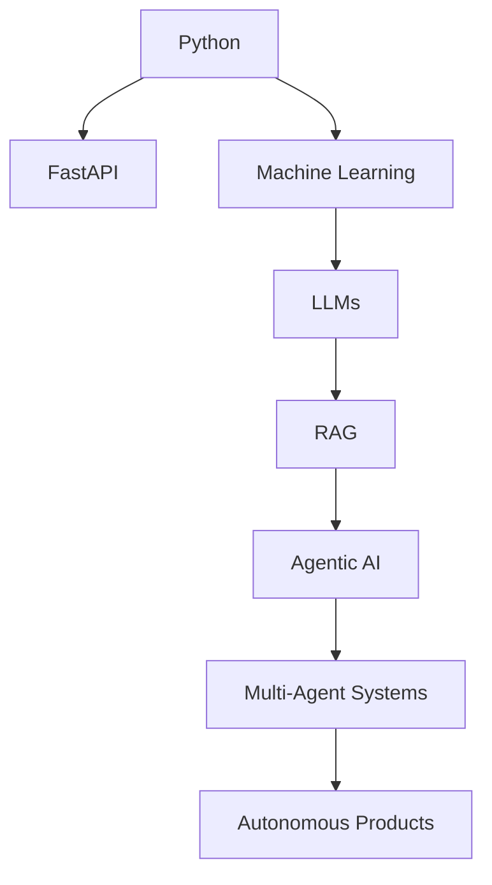

# SYSTEM:// MUDASIR.OS

```yaml
STATUS:
  Name: Muhammad Mudasir Sheikh
  Version: 23.0
  Role: Agentic AI Engineer
  Location: Earth
  Mission: Build Autonomous Intelligence

SYSTEM_STATE:
  Curiosity: 100%
  Learning_Mode: ACTIVE
  Sleep_Mode: DISABLED
  AI_Obsession: TRUE
```

---

## BOOT LOG

```console
[2003] Human Instance Created...
[2023] Computer Science Journey Started...
[2025] Discovered Agentic AI...
[2026] Building Autonomous Systems...
[∞] Mission Continues...
```

---

## WHOAMI

I don't want to build applications.

I want to build systems that can:

✓ Observe

✓ Think

✓ Plan

✓ Decide

✓ Execute

without waiting for human instructions every second.

Most software follows commands.

I am interested in software that creates strategies.

---

## CURRENT EXECUTION TREE

```text
MUDASIR.OS
│
├── Python
│   ├── FastAPI
│   ├── Async Programming
│   └── Automation
│
├── Artificial Intelligence
│   ├── LLMs
│   ├── RAG
│   ├── Agentic AI
│   └── Multi-Agent Systems
│
├── Computer Vision
│   ├── OpenCV
│   └── MediaPipe
│
└── Infrastructure
    ├── Linux
    ├── Docker
    └── Distributed Systems
```

---

# AI PHILOSOPHY

```python
while alive:

    learn()

    build()

    fail()

    improve()

    repeat()
```

---

# ACTIVE QUESTS

□ Build Production FastAPI APIs

□ Master Agentic AI

□ Create Multi-Agent Systems

□ Build AI Products

□ Contribute Open Source

□ Launch Startup

□ Change Something Meaningful

---

# KNOWLEDGE GRAPH



---

# CURRENTLY LOADING...

██████████░░░░░░░░░ 50%

```yaml
Python:
  Progress: ██████████ 100%

FastAPI:
  Progress: ████████░░ 80%

Machine Learning:
  Progress: ██████░░░░ 60%

RAG:
  Progress: █████░░░░░ 50%

Agentic AI:
  Progress: ████░░░░░░ 40%

Startup Building:
  Progress: █░░░░░░░░░ 10%
```

---

# CORE DIRECTIVE

```text
Build AI that doesn't wait.

Build AI that works.

Build AI that acts.
```

---

# SYSTEM CAPABILITIES

```json
{
  "Backend": [
    "FastAPI",
    "REST APIs",
    "Async APIs"
  ],

  "AI": [
    "LLMs",
    "RAG",
    "Prompt Engineering",
    "Agentic AI"
  ],

  "Vision": [
    "OpenCV",
    "MediaPipe"
  ],

  "Infrastructure": [
    "Linux",
    "Docker"
  ]
}
```

---

# LIVE TELEMETRY

<p align="center">

</p>

<p align="center">


</p>

---

# TRANSMISSION CHANNELS

```bash
LinkedIn  -> /network/connect
Email     -> /communication/send
GitHub    -> /repositories/explore
```

---

# FINAL MESSAGE

If you are reading this profile...

You are not looking at a finished engineer.

You are looking at an engineer in compilation.

Version 1.0 was born.

Version 2.0 is loading.

The final release does not exist.
