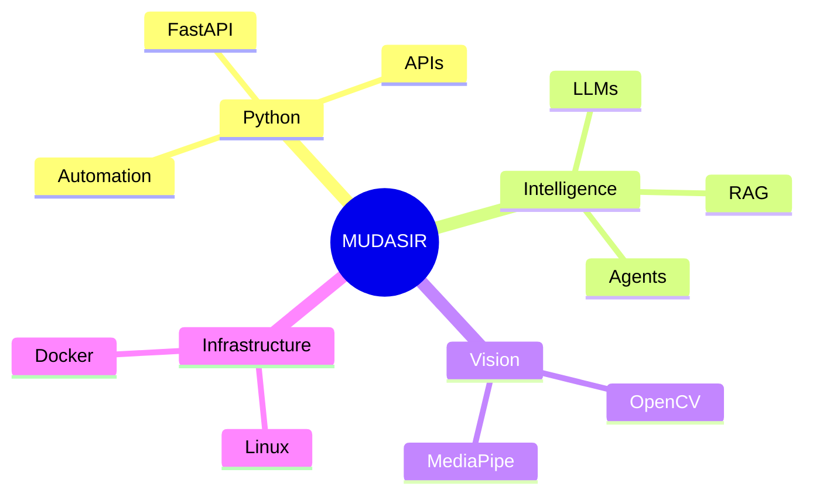

<div align="center">

# ███████████████████████████
# ARTIFACT : MUDASIR-01
# ███████████████████████████

</div>

---

```diff
! NOTICE

This repository does not belong to a developer.

This repository contains fragments of an evolving intelligence.

Proceed with caution.
```

### TIMELINE RECOVERED

```text
2023 ▓░░░░░░░░░ Human Student

2024 ███░░░░░░░ First Python Programs

2025 ██████░░░░ FastAPI Systems

2026 █████████░ Agentic AI Research

2027 ????????? Autonomous Intelligence
```

---

# MEMORY FRAGMENT 001

> I started learning programming.

Status:

```text
Recovered: ██████████ 100%
```

---

# MEMORY FRAGMENT 017

```python
goal = """
Build software that does not wait for instructions.
"""

while True:

    observe()

    reason()

    act()

    improve()
```

---

# COGNITIVE MAP



---

# FUTURE PREDICTION ENGINE

```yaml
forecast:

  software_engineer: possible

  ai_engineer: likely

  startup_founder: highly_likely

  autonomous_systems_architect: inevitable
```

---

# ACTIVE SIGNALS

<div align="center">


</div>

---

# FINAL LOG

```text
If you are reading this profile...

You are viewing an unfinished system.

Current Version:
MUDASIR 0.8

Stable Release:
Unknown

Potential:
Unbounded
```

---

<div align="center">

## END OF RECOVERED DATA

Transmission Lost...

</div>
