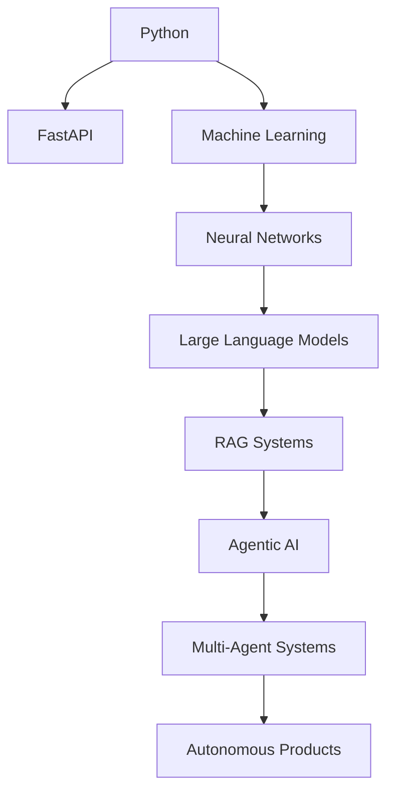

<div align="center">


</div>

<div align="center">


</div>

---

# 🧠 SYSTEM OVERVIEW

```yaml
SYSTEM:
  NAME: Muhammad Mudasir Sheikh
  ROLE: Agentic AI Engineer
  STATUS: Online
  MODE: Learning + Building
  LOCATION: Earth
  MISSION: Build Autonomous Intelligence

CORE_DIRECTIVE:
  Transform AI from conversation
  into execution.
```

---

# ⚡ WHO AM I?

```python
class MuhammadMudasir:

    def __init__(self):

        self.role = "Agentic AI Engineer"

        self.education = "BS Computer Science"

        self.focus = [
            "Agentic AI",
            "Multi-Agent Systems",
            "FastAPI",
            "Computer Vision",
            "RAG Systems",
            "LLMs"
        ]

    def mission(self):
        return "Build AI that thinks, plans and acts."
```

---

# 🚀 CURRENT MISSION

```text
┌────────────────────────────────────────────┐
│                                            │
│  BUILDING AUTONOMOUS AI SYSTEMS            │
│                                            │
│  ✓ FastAPI APIs                            │
│  ✓ AI Agents                               │
│  ✓ Tool Calling Systems                    │
│  ✓ RAG Pipelines                           │
│  ✓ Computer Vision Apps                    │
│  ✓ Multi-Agent Architectures               │
│                                            │
└────────────────────────────────────────────┘
```

---

# 🛰 LIVE DEVELOPMENT MATRIX

```text
Python                ████████████████████ 100%

FastAPI               █████████████████░░  90%

Linux                 ████████████████░░░  85%

Computer Vision       ██████████████░░░░░  75%

Machine Learning      █████████████░░░░░░  70%

RAG Systems           ███████████░░░░░░░░  60%

Agentic AI            ██████████░░░░░░░░░  55%

Multi-Agent Systems   ███████░░░░░░░░░░░░  40%
```

---

# 🛠 TECH ARSENAL

<div align="center">


<br><br>


</div>

---

# 🌐 KNOWLEDGE EVOLUTION MAP



---

# 🤖 AGENT CORE

```json
{
  "memory": true,
  "reasoning": true,
  "planning": true,
  "tool_usage": true,
  "learning": true,
  "autonomous_execution": "in_progress"
}
```

---

# 📡 LIVE TELEMETRY

<div align="center">


</div>

<br>

<div align="center">


</div>

<br>

<div align="center">


</div>

---

# 🐍 CONTRIBUTION LIFEFORM

<div align="center">


</div>

---

# 🎯 CURRENT OBJECTIVES

```text
[01] Master Agentic AI                     ███████░░░

[02] Build Production AI APIs              ████████░░

[03] Create Multi-Agent Systems            █████░░░░░

[04] Launch AI Startup                     ██░░░░░░░░

[05] Build Something Legendary             █░░░░░░░░░
```

---

# 📬 COMMUNICATION CHANNELS

<div align="center">

<a href="https://linkedin.com">

</a>

<a href="mailto:CSC23S209@stu.smiu.edu.pk">

</a>

</div>

---

# 🔥 FINAL TRANSMISSION

```text
Most software waits for commands.

The future belongs to systems
that understand objectives.

I'm building for that future.
```

<div align="center">

### ⚡ MUDASIR.AI IS UNDER ACTIVE DEVELOPMENT ⚡


</div>


